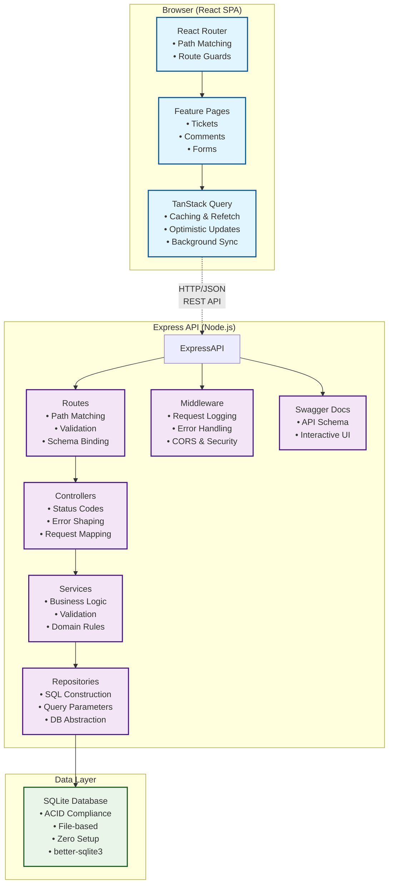
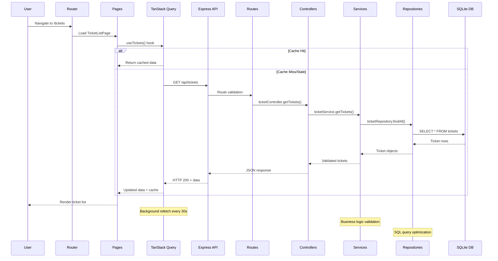
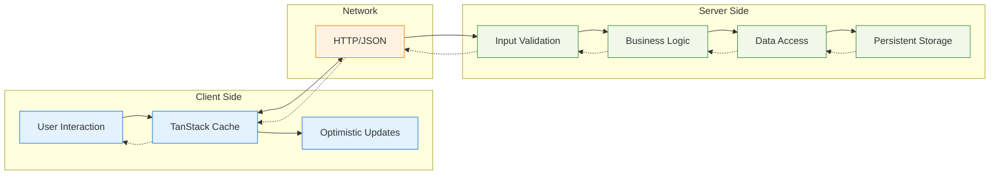

## **System Architecture**



## **Request Flow Diagram**



## **Data Flow Architecture**




All communication is via REST/JSON over HTTP. TanStack Query (React Query) is the single source of truth for server state. It handles caching, background refetching, stale detection, and retry logic — eliminating the need for a separate global store for async data. Local UI state (form inputs, modal open/close) stays in component-scoped `useState`.

**Why TanStack Query over Redux/Zustand/Context:**
- This app is overwhelmingly *server-centric*. Nearly all meaningful state lives in the database (tickets, comments). Redux or Zustand would duplicate that state and require manual cache invalidation — the exact problem TanStack Query solves.
- Context alone cannot handle caching, deduplication, or background sync.
- TanStack Query's `invalidateQueries` gives us precise, automatic cache invalidation after mutations with zero boilerplate.


| Layer        | Responsibility                                           |
|--------------|----------------------------------------------------------|
| Routes       | Path matching, middleware binding, validation schemas    |
| Controllers  | Request/response mapping, status codes, error shaping   |
| Services     | Business logic, domain rules, cross-concern orchestration|
| Repositories | SQL construction, parameterized queries, DB access       |

This strict layering means any layer can be swapped (e.g., Postgres driver, different ORM) without touching business logic.

---


- `id` is a UUID (v4). Avoids sequential ID leakage, supports future distributed writes.
- `status` and `priority` are stored as TEXT with CHECK constraints, enforcing valid enums at the DB level — a second line of defense after application validation.
- `createdAt` / `updatedAt` are ISO-8601 timestamps. SQLite stores them as TEXT; application code handles formatting.


- `ticketId` is a foreign key with `ON DELETE CASCADE`. If a ticket is hard-deleted, its comments vanish atomically.
- Comments are append-only (no UPDATE endpoint). This is a deliberate domain decision: support ticket comments are an audit trail. Editing history would require versioning; for this scope, immutability is correct.
- `authorName` is a plain text field. A full auth system (JWT, OAuth) is outside scope but the column is positioned for a future `authorId` FK.


```sql
CREATE INDEX idx_tickets_status   ON tickets(status);
CREATE INDEX idx_tickets_priority ON tickets(priority);
CREATE INDEX idx_tickets_created  ON tickets(created_at);
CREATE INDEX idx_comments_ticket  ON comments(ticket_id, created_at);
```
- Single-column indexes on status/priority support fast filtering.
- `created_at` index supports ORDER BY without a full table scan.
- Composite index on `(ticket_id, created_at)` covers the most common comment query pattern: "all comments for ticket X, ordered by time."

---


All list endpoints use **offset-based pagination** (`page` + `limit`). This is appropriate here because:
- Ticket volumes in a support desk are bounded (thousands, not billions).
- Offset pagination maps cleanly to UI "page N" navigation.
- Cursor-based pagination would add complexity with minimal benefit at this scale.

Default `limit` is 20; max is capped at 100 server-side to prevent abuse.


Search (`q` param) uses SQL `LIKE '%query%'` with case-insensitive matching. For this data volume this is acceptable. At scale, the migration path is clear: replace with a dedicated search index (Elasticsearch, Typesense, or PostgreSQL `pg_trgm`). The repository layer isolates this query so the swap is a single-file change.


**Decision: Server-side.** Client-side search would require fetching all tickets into memory. As ticket count grows, this becomes a network and memory problem. Server-side search keeps the payload small and lets us add indexing later without frontend changes.

---


1. **Frontend**: React Hook Form + Zod schemas give instant, accessible feedback.
2. **Backend Route Layer**: Zod schemas on every request body/query. Malformed requests are rejected at the boundary with 400 + structured error payloads before reaching business logic.
3. **Database Layer**: CHECK constraints, NOT NULL, and FK constraints as a final guard.


- All API errors return a consistent shape: `{ error: { code, message } }`.
- The frontend wraps every TanStack Query hook with a shared error-display component, so error states are handled uniformly across pages.
- Unhandled errors are caught by Express error middleware and logged before returning a generic 500.


- Updating a ticket to its current status (idempotent — returns 200, not an error).
- Posting a comment to a deleted ticket (404).
- Concurrent edits: `updatedAt` is always set server-side, providing a last-write-wins semantic. Full optimistic locking (e.g., ETag) is noted as a future extension.
- Empty search queries return the full paginated set (no special-case needed).

---


| Skipped                        | Reason                                                                 |
|--------------------------------|------------------------------------------------------------------------|
| Authentication / Authorization | Scope. Column structure supports future FK to a `users` table.         |
| Soft delete                    | Hard delete chosen for simplicity. Audit trail via comments is retained.|
| WebSockets / real-time updates | Polling via TanStack Query's `refetchInterval` is sufficient at this scale. |
| Full-text search index         | `LIKE` is adequate for expected volume. Migration path is isolated.    |
| Rate limiting                  | Out of scope for this tier. Can be added at the Express middleware layer.|
| Cursor-based pagination        | Offset is simpler and sufficient. See §3.                              |
| Comment editing/deletion       | Comments are an audit trail — immutability is the correct domain choice.|
